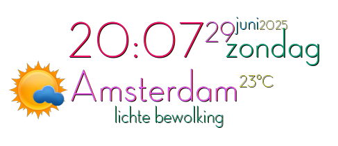

# clock-weather-conky



A stylish and informative Conky configuration that displays time, date, and live weather information on your Linux desktop. This project combines Conky, shell scripts, and OpenWeatherMap to create a visual clock and weather widget, including dynamic icons.

## Features

- **Digital clock** and date, beautifully centered on your desktop.
- **Live weather information** (temperature, description, location), automatically fetched via OpenWeatherMap.
- **Weather icons** are dynamically displayed and adapt to the current weather.
- **Fully customizable** in color, font, and alignment via `conky.conf`.
- **Cache system** to limit API calls and improve speed.
- **Multi-language support** (default: Dutch, but configurable).

## Installation

1. **Requirements**
   - Linux system with Conky installed (`sudo apt install conky`)
   - Bash
   - curl
   - OpenWeatherMap API key ([get one for free](https://openweathermap.org/api))
   - Adele font

2. **Clone the repository**
   ```bash
   git clone https://github.com/wim66/clock-weather-conky.git
   cd clock-weather-conky
   ```

3. Install Adele font

4. **Configure your API key and city**
   There are two ways to provide your OpenWeatherMap API key and City ID:
   - **Recommended:** Create a `.env` file or add the following variables to your shell profile:
     ```bash
     export OWM_API_KEY="your_openweathermap_apikey"
     export CITY_ID="your_city_id"
     ```
     This is the easiest approach, especially if you want to use multiple (different) weather widgets.
   - **Alternatively:** You can place your `OWM_API_KEY` and `CITY_ID` values directly at the top of the `weather.sh` script by replacing the variable assignments:
     ```bash
     API_KEY="your_openweathermap_apikey"
     CITY_ID="your_city_id"
     ```
     However, using environment variables is more flexible and recommended for switching between different widgets.

   - You can find your City ID here: https://openweathermap.org/find

5. **Optional:** Adjust icons and colors in `conky.conf` and the `icons/` folder.

6. **Start the widget**
   ```bash
   ./start.sh
   ```

   This script:
   - Stops any running Conky processes
   - Fetches the latest weather data and prepares the icons
   - Starts Conky with the proper configuration

## Configuration

- **Weather settings:** See the top of `weather.sh` for options such as unit (metric/imperial), language (LANG), and cache behavior.
- **Conky layout:** Edit `conky.conf` to adjust layout, colors, and fonts.
- **Icons:** Place your own PNG icons in the `icons/` directory (the naming follows OWM icon codes, see the script).

## Troubleshooting

- Check that your API key and City ID are set correctly.
- Look for error messages in the terminal.
- Ensure all required packages are installed.
- For more info about the code: [view the repository on GitHub](https://github.com/wim66/clock-weather-conky)

## License

This project is licensed under the terms of the [LICENSE](LICENSE) file included in this repository.
